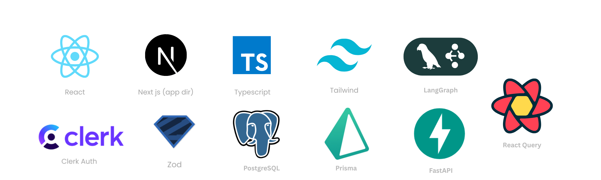
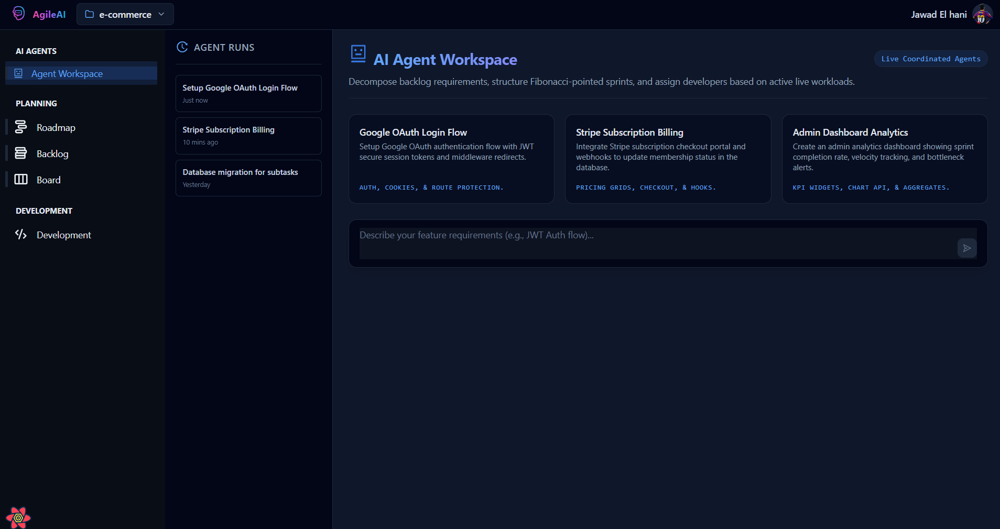
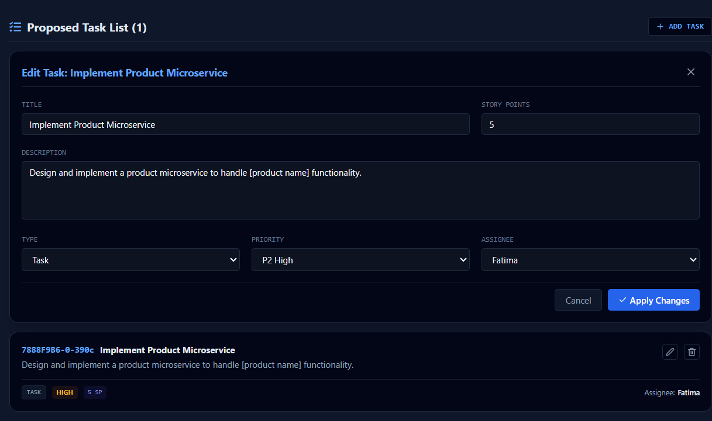

<h1 align="center">🚀 AgileAI</h1>

<p align="center">
An AI-powered Agile Project Management Platform that automates Scrum workflows using a Multi-Agent Architecture.
</p>

---






## Overview

AgileAI is an intelligent project management platform designed to help software development teams adopt Agile and Scrum practices more efficiently.

Unlike traditional tools that require significant manual effort from Scrum Masters and project managers, AgileAI introduces autonomous AI agents capable of generating tasks, planning sprints, assigning work, managing workflows, and automating project operations.

The platform combines a modern full-stack web application with a dedicated AI agent ecosystem powered by LangGraph and Groq LLMs.

---

## Architecture

The system is composed of two main layers:

### Web Platform

- Next.js 15
- React
- TypeScript
- Tailwind CSS
- Prisma ORM
- PostgreSQL

### AI Agent System

- LangGraph
- LangChain
- Groq LLM
- Multi-Agent Orchestration
- State Persistence
- Tool Calling

---

## Core Features

### Project Management

- Project creation and management
- Sprint planning
- Backlog management
- Task tracking
- Team management
- Agile workflow monitoring

### AI-Powered Automation

#### Task Agent

- Converts feature descriptions into structured Agile tasks
- Generates acceptance criteria
- Estimates story complexity

#### Assignment Agent

- Assigns tasks to team members
- Balances workloads
- Matches skills with requirements

#### Planning Agent

- Generates sprint plans
- Prioritizes backlog items
- Suggests sprint capacity allocation

#### Workflow Agent

- Monitors task progression
- Detects bottlenecks
- Recommends workflow improvements

#### Automation & Integration Agent

- Handles automated project actions
- Integrates AI-driven workflows
- Supports event-based automation

#### Orchestrator Agent

- Coordinates communication between agents
- Routes requests to specialized agents
- Maintains system-wide context

---

## Technology Stack

### Frontend

- Next.js
- React
- TypeScript
- Tailwind CSS
- Radix UI

### Backend

- Next.js API Routes
- Prisma ORM
- PostgreSQL

### AI Layer

- LangGraph
- LangChain
- Groq

### Database

The platform uses a single PostgreSQL database with two schemas:

- `business` → application data (users, projects, tasks, teams)
- `agents` → AI memory, checkpoints, workflows, and execution states

This architecture provides logical separation while maintaining operational simplicity.

---

## Database Structure

### Business Schema

Contains:

- Users
- Teams
- Projects
- Sprints
- Tasks
- Backlogs
- Assignments

### Agents Schema

Contains:

- Agent Checkpoints
- Agent Memories
- Workflow States
- Execution Logs
- AI Context Storage

---

## Development Setup

### Prerequisites

- Node.js 20+
- PostgreSQL 15+
- Python 3.11+
- npm

---

### Clone Repository

```bash
git clone <repository-url>
cd agileai
```

### Install Frontend Dependencies

```bash
npm install
```

### Install Agent Dependencies

```bash
cd Agents
pip install -r requirements.txt
```

### Configure Environment

Create a `.env` file:

```env
DATABASE_URL=
GROQ_API_KEY=
NEXT_PUBLIC_APP_URL=http://localhost:3000
```

### Create Database Schemas

```sql
CREATE SCHEMA business;
CREATE SCHEMA agents;
```

### Generate Prisma Client

```bash
npx prisma db push
npx prisma generate
```

### Start Next.js Application

```bash
npm run dev
```

Runs on:

```text
http://localhost:3000
```

### Start AI Agent Service

```bash
cd Agents
python main.py
```

---

## Testing

### Frontend

```bash
npm run test
```

### Agents

```bash
pytest
```

---

## Project Structure

```text
AgileAI/
│
├── app/                    # Next.js App Router
├── components/             # UI Components
├── lib/                    # Utilities
├── prisma/                 # Prisma Schema
│
├── Agents/
│   ├── task_agent/
│   ├── assignment_agent/
│   ├── planning_agent/
│   ├── workflow_agent/
│   ├── automation_agent/
│   ├── orchestrator/
│   └── persistence/
│
├── public/
└── docs/
```

---

## Future Enhancements

- Jira Integration
- GitHub Integration
- Slack Integration
- Predictive Sprint Analytics
- AI Sprint Retrospectives
- Advanced Reporting Dashboard
- Multi-Project Optimization
- Real-Time Team Performance Insights

---

## Contributing

Contributions are welcome through:

- Bug reports
- Feature requests
- Pull requests

Please follow the project's coding standards and testing practices before submitting contributions.

---

## License

This project is licensed under the MIT License.
